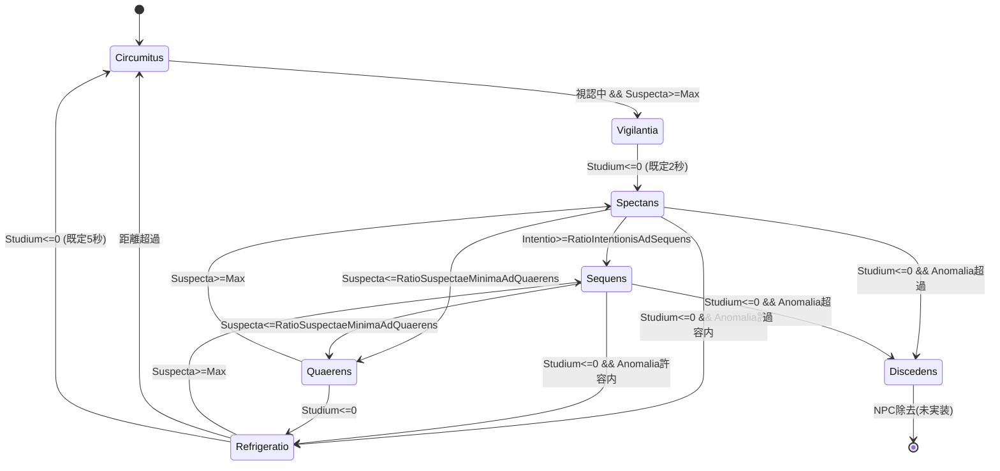

# MachinaCivisCustodiae 設計資料

Civis(市民) 1体ごとの警戒ステートマシン本体。
`MilesCivisCustodiae` から `Initare` / `Ordinare` を呼ばれ、現在ステートを保持し、
毎フレーム「遷移判定 → 入退場 → 現在ステート更新」を駆動する。

各ステートは疑心(`Suspecta`)・興味(`Studium`)・緊張(`Intentio`)の3蓄積値(fluida)を
増減させ、その値と瞬間条件(視認/聴認/Anomalia)をもとに次ステートを決める。

---

## 1. 配置と責務分担

```
MachinaCustodiae/
├── MachinaCivisCustodiae.cs          … 親玉。遷移駆動と現在ステート保持
├── MachinaCivisCustodiae.md          … 本資料
├── Interna/                          … マシン内部ユーティリティ
│   ├── TabulaCivisStatusCustodiae.cs … ID → ステート実体の引き当て
│   ├── AbaciCivisStatusCustodiae.cs  … fluida毎の時間補正器(Civis配列)
│   └── ResolutorCivisStatusCustodiae.cs … 増減量の純計算(static)
└── Statuum/                          … ステート契約と実装
    ├── IStatusCivisCustodiae.cs
    ├── StatusCivisCustodiaeAttendens.cs   (abstract)
    ├── StatusCivisCustodiaeIntuitus.cs    (abstract)
    └── StatusCivisCustodiae*.cs           (具象7種)
```

設定アセットは本フォルダ外(`ImperiumMaius.Configuratio`)にあり、
契約は `ImperiumDelegatum.Contractus` の `IConfiguratioCivisCustodiaeStatus*` で結ぶ。

| 層 | 役割 |
|---|---|
| `MachinaCivisCustodiae` | 現在ステートID配列を持ち、遷移と `Initare`/`Exire`/`Ordinare` を駆動する。 |
| `TabulaCivisStatusCustodiae` | 構築時に全ステートを1個ずつ生成し、IDで引き当てる。 |
| `AbaciCivisStatusCustodiae` | Suspecta/Studium/Intentio の時間補正(`AbacusTemporis`)と方向切替猶予をCivis毎に保持。 |
| `ResolutorCivisStatusCustodiae` | 増減量・Anomalia補正の純計算(static)。状態を持たない。 |
| `IStatusCivisCustodiae` 実装群 | 入場/退場/毎フレーム更新/遷移判定。 |
| `IConfiguratioCivisCustodiaeStatus*` | レート・閾値・シグモイド形状。ScriptableObjectで供給。 |

ステートID(`IDCivisStatusCustodiae`)は
`Nihil` / `Circumitus` / `Vigilantia` / `Spectans` / `Sequens` / `Quaerens` / `Refrigeratio` / `Discedens`。
`Nihil` は実体を持たない特別値で、`MutareStatus` の戻り値としては**「遷移しない」**を意味する。

---

## 2. MachinaCivisCustodiae(親玉)

### 所有物

```
MachinaCivisCustodiae
├─ TabulaCivisStatusCustodiae _tabula   … ステート実体テーブル(全Civisで共有)
├─ AbaciCivisStatusCustodiae  _abaci    … 時間補正器(Civis配列)
└─ IDCivisStatusCustodiae[]   _statusCustodiaeCurrens
                                         … Civis毎の現在ステートID
```

ステート実体はシングルトン的に1個ずつしか持たない。
Civis固有の可変状態は `_statusCustodiaeCurrens` と `_abaci`、および
`ResFluida` 側の fluida / `StatusCustodiaeCurrens` 通知に置く。

### コンストラクタ依存

| 依存 | 用途 |
|---|---|
| `IConfiguratioCivisCustodiaeStatus` | 各ステート設定と Communis を Tabula / Abaci へ分配 |
| `IResFluidaCivisVeletudinisLegibile` | Suspecta/Studium/Intentio/視力/聴力/Torelantia 等の読み取り |
| `IResFluidaPuellaeVeletudinisLegibile` | Anomalia / Claritas 等 |
| `IOstiumCivisLegibile` | Civis長(`Longitudo`)。`_statusCustodiaeCurrens` / Abaci の配列確保に使用 |
| `IResFluidaCivisCustodiaeLegibile` | 視認量・聴認量・距離・瞬間bool |
| `IOstiumCarrusCivis` | fluida差分と `StatusCustodiaeCurrens` の書き込み依頼 |
| `IOstiumTemporisLegibile` | `Intervallum`(Δt) |

構築時の流れ:

1. Config から各ステート用 `IConfiguratio*` を取り出し `Tabula` を生成(全ステート new)。
2. `Communis` で `Abaci` を生成(Civis長ぶんの Abacus / Horologium)。
3. `_statusCustodiaeCurrens` を Civis長で確保(初期値は enum の default = `Nihil`)。

### MilesCivisCustodiae からの呼び出し順

`MilesCivisCustodiae` 内での警戒処理の位置づけ:

| メソッド | 内容 |
|---|---|
| `Initare(idCivis)` | Distantia / NudusVisae / IctuumVisae / IctuumAuditae の Init の後、`Machina.Initare` |
| `OrdinareCustodiae(idCivis)` | Distantia → NudusVisae → **`Machina.Ordinare`** |
| `ResolvereIctuum(idCivis)` | 視認量・聴認量の解決(Machinaとは別タイミング) |

Machina は「既に書き込まれている」`ResFluidaCivisCustodiae` /
`ResFluidaCivisVeletudinis` / Puellae の値を読んで遷移と増減を行う。
視認量そのものの解決は `Ictuum` 系リゾルバの責務。

### Initare(idCivis)

1. `_statusCustodiaeCurrens[idCivis] = Circumitus`
2. `Tabula.Legere(Circumitus).Initare(idCivis, abaci)`

起点は常に巡回。Circumitus 入場処理で fluida を 0 にし Abaci を全リセットする。

### Ordinare(idCivis)

毎フレーム以下の順:

1. 現在ステートの `MutareStatus(idCivis)` で次ステートIDを得る。
   判定に使う fluida は**前フレーム確定済み**の `ResFluida` 値。
2. 次IDが現在と異なり、かつ `Nihil` でなければ遷移する。
   - 現ステート `Exire(idCivis, abaci)`
   - `_statusCustodiaeCurrens` を差し替え
   - 新ステート `Initare(idCivis, abaci)`
3. (遷移後の)現在ステート `Ordinare(idCivis, abaci)`

**遷移が起きたフレームは `Initare` と `Ordinare` が同一フレーム内で連続実行される。**
`Initare` で積んだ差分に、同フレームの `Ordinare` の増減が上乗せされる。

`Exire` は現状すべてのステートで空実装。

マシン自身は `StatusCustodiaeCurrens` を `ResFluida` へ直接書かない。
各ステートの `Initare` が `Carrus.PostulareVeletudinisCondicionis` で通知する。

---

## 3. Interna

### TabulaCivisStatusCustodiae

`IDCivisStatusCustodiae` の enum 長で配列を確保し、構築時に具象ステートを配置する。
`Nihil` スロットは `null`。`Legere(id)` は配列添字参照のみ。

生成される具象と受け取る Config:

| ID | クラス | Config |
|---|---|---|
| Circumitus | `StatusCivisCustodiaeCircumitus` | `…StatusCircumitus` |
| Vigilantia | `StatusCivisCustodiaeVigilantia` | `…StatusVigilantia` |
| Spectans | `StatusCivisCustodiaeSpectans` | `…StatusSpectans` |
| Sequens | `StatusCivisCustodiaeSequens` | `…StatusSequens` |
| Quaerens | `StatusCivisCustodiaeQuaerens` | `…StatusQuaerens` |
| Refrigeratio | `StatusCivisCustodiaeRefrigerationis` | `…StatusRefrigerationis` |
| Discedens | `StatusCivisCustodiaeDiscedens` | `…StatusDiscedens` |

### AbaciCivisStatusCustodiae

Suspecta / Studium / Intentio それぞれについて、Civis毎に:

- `AbacusTemporis` ×2(`Habere` 増加 / `Amittere` 減少)
- `Horologium`(`TempusXxxConservandi` による方向切替猶予)
- 現在方向フラグ(`_estAugereXxx`)

を持つ。形状パラメータはすべて `IConfiguratioCivisCustodiaeStatusCommunis` から取る。

`ResolvereDirectionemXxx(id, estAugereCurrens, Δt)` の挙動:

| 遷移 | 挙動 |
|---|---|
| 方向維持 | 猶予中ならキャンセルし、猶予中に進んだ `Amittere` を破棄 |
| 減少 → 増加 | 即切替。`Amittere` リセット |
| 増加 → 減少 | 猶予満了まで待ってから切替し、`Habere` をリセット |

最後に現在方向の Abacus を `Δt` だけ進める。
`AbacusTemporis.ComputareRatio()` は継続時間をシグモイドLUTで 0→1 にした係数。

| メソッド | 効果 |
|---|---|
| `Purgere(idCivis)` | 3種すべての Abacus / Horologium / 方向フラグをリセット |
| `PurgereSuspectae` / `PurgereStudii` / `PurgereIntentionis` | 該当fluidaのみ |

ステートが値を 0 や最大に強制するとき、対応 Abacus も `Purgere` してカーブを積み直すのが原則。

### ResolutorCivisStatusCustodiae

状態を持たない static 計算。主な API:

| メソッド | 内容 |
|---|---|
| `AugereSuspectaeVisae` | 視覚由来 Suspecta 増加量 |
| `AugereSuspectaeAuditae` | 聴覚由来 Suspecta 増加量(`ratio`=聴認量, `civisAuditus`=Civis聴力) |
| `DeminuereSuspectam` | Suspecta 減少量(符号なし。呼び出し側で負にする) |
| `AugereStudiumIntuitus` / `DeminuereStudiumIntuitus` | Intuitus系 Studium |
| `AugereIntentionisIntuitus` / `DeminuereIntentionisIntuitus` | Intuitus系 Intentio |
| `ResolvereTorelantiamAnomaliae` | 許容帯内の係数(外=0、下限〜中心=SmoothStep、中心〜上限=1) |
| `CorrigereAnomaliae` / `CorrigereRatioAnomaliae` | `EstSpectareNudus` なら Nudus 側の値を返す |

Statuum 内の Anomalia 取得はすべてこの Corrigere 経由で統一されている。

---

## 4. Configuratio

### 配線

```
ConfiguratioExercitusCivis (SO)
 └─ CustodiaeStatus : ConfiguratioCivisCustodiaeStatus (SO)
     ├─ Communis
     ├─ Circumitus / Vigilantia / Spectans / Sequens
     ├─ Quaerens / Refrigerationis / Discedens
     │
     └─(IConfiguratioCivisCustodiaeStatus として)
         MilesCivisCustodiae → MachinaCivisCustodiae
```

契約(`Contractus`)と実装(`ImperiumMaius.Configuratio`)の対応:

| 契約 | ScriptableObject 実装 |
|---|---|
| `IConfiguratioCivisCustodiaeStatus` | `ConfiguratioCivisCustodiaeStatus`(ルート。各サブアセット参照) |
| `IConfiguratioCivisCustodiaeStatusCommunis` | `ConfiguratioCivisCustodiaeStatusCommunis` |
| `IConfiguratioCivisCustodiaeStatusAttendens` | `ConfiguratioCivisCustodiaeStatusAttendensBasis`(abstract) |
| `IConfiguratioCivisCustodiaeStatusIntuitus` | `ConfiguratioCivisCustodiaeStatusIntuitusBasis`(abstract) |
| `…StatusCircumitus` | `ConfiguratioCivisCustodiaeStatusCircumitus` : AttendensBasis |
| `…StatusVigilantia` | `ConfiguratioCivisCustodiaeStatusVigilantia`(単独 SO。Attendens 非継承) |
| `…StatusSpectans` | `ConfiguratioCivisCustodiaeStatusSpectans` : IntuitusBasis |
| `…StatusSequens` | `ConfiguratioCivisCustodiaeStatusSequens` : IntuitusBasis |
| `…StatusQuaerens` | `ConfiguratioCivisCustodiaeStatusQuaerens` : AttendensBasis |
| `…StatusRefrigerationis` | `ConfiguratioCivisCustodiaeStatusRefrigerationis` : AttendensBasis |
| `…StatusDiscedens` | `ConfiguratioCivisCustodiaeStatusDiscedens` : AttendensBasis |

設定の継承関係は**ステートクラスの継承関係と対応**する。
ステート毎に別アセットなので、「`Sequens` は `Spectans` より Suspecta 減衰が遅い」等を設定だけで調整できる。

### IConfiguratioCivisCustodiaeStatusCommunis → Abaci 専用

Suspecta / Studium / Intentio × Habere / Amittere の6組のシグモイド形状。

| 項目(`Xxx` = `Suspectae` / `Studii` / `Intentionis`) | 既定値 | 意味 |
|---|---|---|
| `TempusXxxStudiumHabereMinima/Media/Maxima` | `0` / `5` / `10` | 増加カーブの起点・中心・終点(秒) |
| `PraeruptioXxxTempusStudiumHabere` | `12` | 増加カーブの急峻さ |
| `TempusXxxStudiumAmittereMinima/Media/Maxima` | `0` / `5` / `10` | 減少カーブ同項目 |
| `PraeruptioXxxTempusStudiumAmittere` | `12` | 減少カーブの急峻さ |
| `TempusXxxConservandi` | `0.5` | 増加→減少切替の猶予(秒) |

`Minima < Media < Maxima` および `Praeruptio > 0` を満たさないと
`AbacusTemporis` 構築時に `Carnifex.Intermissio` で停止する。

### IConfiguratioCivisCustodiaeStatusAttendens

`Vigilantia` 以外の全ステートが共有(AttendensBasis)。

| 項目 | 既定値 | 意味 |
|---|---|---|
| `AugmentumSuspectaeVisaeSec` | `0.5` | 視覚刺激の Suspecta 基礎増加(毎秒) |
| `AugmentumSuspectaeAuditaeSec` | `0.3` | 聴覚刺激の Suspecta 基礎増加(毎秒) |
| `DeminutioSuspectaeSec` | `0.3` | Suspecta 基礎減少(毎秒) |
| `SuspectaMaximaNihilAnomaliae` | `0.3` | Anomalia=0 のときの Suspecta 上限 |
| `SuspectaMaximaAuditaeSolus` | `0.5` | 視認無し(音のみ)の Suspecta 上限 |
| `SuspectaMaximaAnomaliaeDeest` | `0.8` | Anomalia不足で Vigilantia 不可の上限 |
| `AnomaliaeMinimaAdVigilantiam` | `200` | Vigilantia に必要な最小 Anomalia(絶対値) |

### IConfiguratioCivisCustodiaeStatusIntuitus

`Spectans` / `Sequens` が共有(IntuitusBasis = Attendens + 以下)。

| 項目 | 既定値 | 意味 |
|---|---|---|
| `AugmentumIntentionisSec` / `DeminutioIntentionisSec` | `0.5` / `0.3` | Intentio 基礎増減(毎秒) |
| `AugmentumStudiumSec` / `DeminutioStudiumSec` | `0.5` / `0.3` | Studium 基礎増減(毎秒) |
| `DeminutioStudiumAdRecusationemSec` | `1.0` | Anomalia超過(拒否)による Studium 減衰(毎秒) |
| `DeminutioStudiumAdAmittensSec` | `0.5` | 視認ロストによる Studium 減衰(毎秒) |
| `RatioSuspectaeMinimaAdQuaerens` | `0.4` | 対 SuspectaMaxima。下回ると Quaerens |

### ステート固有

| 実装クラス | 項目 | 既定値 | 意味 |
|---|---|---|---|
| `…StatusVigilantia` | `DeminutioStudiumAdIntuitusSec` | `0.5` | Studium 減衰。`StudiumMaxima / この値` 秒で終了 |
| `…StatusSpectans` | `RatioIntentionisAdSequens` | `0.5` | 対 IntentioMaxima。以上で Sequens |
| `…StatusQuaerens` | `DeminutioStudiumAdCassationemSec` | `0.5` | 捜索中の Studium 減衰。`Studium <= 0` で Refrigeratio |
| `…StatusRefrigerationis` | `DistantiaRefrigerationis` | `20` | 超過でクールダウン解除 |
| `…StatusRefrigerationis` | `DeminutioStudiumAdRefrigerationemSec` | `0.2` | 冷却中 Studium 減衰(持続時間) |
| Circumitus / Sequens / Discedens | (固有項目なし) | — | 基底のみ |

---

## 5. 値の更新規約(dt指定)

ステートは値を直接書かず、`IOstiumCarrusCivis.PostulareVeletudinisValoris` に**差分(dt)**を積む。
`ExecutorCivisVeletudinis` が1フレーム分を合算し、`ResFluidaCivisVeletudinis` 側で
`[0, Maxima]` にクランプして反映する。

| 記述 | 実際の意味 |
|---|---|
| `dtSuspecta: +SuspectaMaxima` | Suspecta を最大にする |
| `dtSuspecta: -SuspectaMaxima` | Suspecta を 0 にする |

`Vigilantia.Ordinare` が毎フレーム `+Maxima` を積むのは、その間ずっと最大固定の意味。
同一フレーム内の複数 `Postulare` は加算される
(`Intuitus.Ordinare` が `base`(Suspecta)と自身(Studium/Intentio)に分かれるのはこのため)。

現状の Maxima 基準値はすべて `1.0`。fluida は実質 0.0〜1.0 のメーター。

---

## 6. パラメータと瞬間条件

### 蓄積パラメータ(fluida)

| 名前 | 意味 | 増加 | 減少 | 主な用途 |
|---|---|---|---|---|
| `Suspecta` | 疑心度 | 視覚 or 聴覚刺激 | 両方無し | `Circumitus→Vigilantia`、`Intuitus→Quaerens`、`Quaerens→Spectans`、`Refrigeratio→Sequens` |
| `Studium` | 興味度 | Intuitusで視認かつ Anomalia耐性帯内 | 帯外/ロスト/専用減衰 | 追跡継続/離脱。**Vigilantia / Quaerens / Refrigeratio では滞在タイマー代用** |
| `Intentio` | 緊張度 | Intuitusで視認かつ耐性帯内(視認量依存) | 上記以外 | `Spectans→Sequens` |

`Studium` がタイマーを兼ねるのが現状の設計。入場時に最大にし固定レートで減らし、
`Studium <= 0` を時間経過判定に使う(専用 Horologium をステートに持たせない)。
二重責務の是非は §11 参照。

### 外部参照値

| 名前 | 取得元 | 用途 |
|---|---|---|
| `Anomalia`(絶対値) | `CorrigereAnomaliae` | Suspecta上限の条件。裸眼時は `AnomaliaNudus` |
| `RatioAnomaliae`(0〜1) | `CorrigereRatioAnomaliae` | Intuitus耐性帯判定と増加係数。裸眼時は `RatioAnomaliaeNudus` |
| `RatioTorelantiaAnomaliaeMaxima/Minima` | `IResFluidaCivisVeletudinisLegibile` | Civis個体の許容帯。**現状どこからも書き込まれず常に0**(§11) |
| `RatioClaritas` | Puellae Veletudinis | Suspecta視覚増加の係数 |
| `RatioVisus`(Civis) | Civis Veletudinis | 視力レシオ(視覚増加に使用) |
| `Auditus`(Civis) | Civis Veletudinis | 聴力絶対値(聴覚増加に使用。レシオではない) |
| `RatioVisus`(Custodiae) | Civis Custodiae | Ictuum解決済み視認量 |
| `Audita`(Custodiae) | Civis Custodiae | Ictuum解決済み聴認量(絶対値) |
| `DistantiaPuellae` | Civis Custodiae | Refrigeratio 解除距離 |

### 瞬間条件

| 条件 | 判定式 |
|---|---|
| 視認中 | `EstCustodiaeVisae && EstVisa` |
| 聴取中 | `EstCustodiaeAuditae && EstAudita` |
| Anomalia耐性帯内 | `RatioTorelantiaMinima <= RatioAnomaliae <= RatioTorelantiaMaxima` |

---

## 7. ステート継承と Suspecta 解決

### 継承関係

```
IStatusCivisCustodiae
├─ StatusCivisCustodiaeVigilantia            (単独実装。Attendensを継承しない)
└─ StatusCivisCustodiaeAttendens (abstract)  … Suspecta
   ├─ StatusCivisCustodiaeCircumitus
   ├─ StatusCivisCustodiaeQuaerens
   ├─ StatusCivisCustodiaeRefrigerationis
   ├─ StatusCivisCustodiaeDiscedens
   └─ StatusCivisCustodiaeIntuitus (abstract) … + Studium / Intentio
      ├─ StatusCivisCustodiaeSpectans
      └─ StatusCivisCustodiaeSequens
```

`Vigilantia` だけが Attendens を継承しない。Suspecta を最大固定するだけで
刺激からの増減計算を行わないため。

契約メソッド: `Initare` / `Exire` / `Ordinare` / `MutareStatus`。
いずれも `(idCivis, abaci)` または `(idCivis)`。Machina が呼ぶ。

### Attendens.Ordinare — Suspecta

`ResolvereSuspectam` → `RestringereSuspectam` の2段。

**ResolvereSuspectam**

- 視覚・聴覚刺激を判定し `estAugere = 視覚 || 聴覚`
- `abaci.ResolvereDirectionemSuspectae` で時間補正を進める
- 増加時は視覚由来・聴覚由来を**それぞれ計算して加算**
  - 視覚: `基礎 × Custodiae.RatioVisus × Civis.RatioVisus × Claritas × 時間補正 × Δt`
  - 聴覚: `基礎 × Custodiae.Audita × Civis.Auditus × 時間補正 × Δt`
- 非増加時: `-DeminuereSuspectam(...)`

**RestringereSuspectam**(増加時のみ。上から評価)

| 条件 | 上限 |
|---|---|
| `Anomalia <= 0` | `SuspectaMaximaNihilAnomaliae` |
| 視認中でない(音のみ) | `SuspectaMaximaAuditaeSolus` |
| `Anomalia <= AnomaliaeMinimaAdVigilantiam` | `SuspectaMaximaAnomaliaeDeest` |

`Circumitus → Vigilantia` は `Suspecta >= SuspectaMaxima` なので、
上記上限に掛かっている間は構造的に Vigilantia へ到達できない。

---

## 8. ステート詳細

`MutareStatus` は**記載順に評価**され、最初に成立した条件が採用される(`Nihil` = 現状維持)。

### Circumitus(巡回) — 起点

- 基底: Attendens
- `Initare`: `StatusCustodiaeCurrens` 通知。Suspecta/Studium/Intentio を 0。`abaci.Purgere`
- `Ordinare`: 基底の Suspecta 増減のみ
- `MutareStatus`
  1. 視認中でなければ `Nihil`(ガード)
  2. `Suspecta >= SuspectaMaxima` → **Vigilantia**

音だけで上限(`SuspectaMaximaAuditaeSolus`)まで溜まっても、視認ガードで Vigilantia には移らない。
「気付いて振り向く」フェーズは独立ステートを持たず、Circumitus 滞在 + 高 Suspecta で表現する。

### Vigilantia(確定検知)

- 基底: なし(`IStatusCivisCustodiae` 直接実装)
- `Initare`: Suspecta最大 / Studium最大 / Intentio=0。`PurgereIntentionis` / `PurgereStudii`
- `Ordinare`: Suspecta最大固定、Intentio=0固定、Studium を `DeminutioStudiumAdIntuitusSec` で減少
- `MutareStatus`: `Studium <= 0` → **Spectans**

既定で約 `1.0/0.5 = 2秒` の待機。演出枠。
意図的に常に Spectans を経由する(Sequens直行なし。分岐複雑化を避ける)。

### Spectans(注視) — Intuitus入口

- 基底: Intuitus
- `Initare`: Suspecta最大 / Studium最大 / Intentio=0。`PurgereIntentionis` / `PurgereStudii`
- `Ordinare`: Intuitus共通(オーバーライドなし)
- `MutareStatus`
  1. Intuitus共通が `Nihil` 以外ならそれ(Quaerens / Refrigeratio / Discedens)
  2. `Intentio >= RatioIntentionisAdSequens × IntentioMaxima` → **Sequens**

### Sequens(追跡)

- 基底: Intuitus
- `Initare`: `StatusCustodiaeCurrens` 通知のみ(**値を初期化しない**。緊張を引き継ぐ)
- `Ordinare` / `MutareStatus`: Intuitus共通をそのまま継承。固有処理なし

**`Sequens → Spectans` 復帰は未実装**。Quaerens / Refrigeratio / Discedens のいずれかまで Sequens のまま。

### Intuitus共通(Spectans / Sequens)

`Ordinare` は基底 Suspecta の後、以下を**排他的に**評価:

1. `RatioAnomaliae > RatioTorelantiaMaxima`(拒否) → Studium を `DeminutioStudiumAdRecusationemSec` で減らし終了
2. 視認ロスト → Studium を `DeminutioStudiumAdAmittensSec` で減らし終了
3. それ以外 → Intentio / Studium の通常増減を積む

拒否・ロスト中は Intentio が更新されない(Abaciも進まない)。
通常増加には `ResolvereTorelantiamAnomaliae` の係数が掛かる。
通常減衰は `-DeminuereIntentionisIntuitus` / `-DeminuereStudiumIntuitus`。

`MutareStatus` 共通:

1. `Suspecta <= RatioSuspectaeMinimaAdQuaerens × SuspectaMaxima` → **Quaerens**
2. `Studium <= 0`
   - `RatioAnomaliae > RatioTorelantiaMaxima` → **Discedens**
   - それ以外 → **Refrigeratio**
3. それ以外 → `Nihil`

### Quaerens(捜索)

- 基底: Attendens
- `Initare`: `StatusCustodiaeCurrens` 通知 + Studium を最大に設定(捜索タイマー開始)
- `Ordinare`: 基底 Suspecta + `DeminutioStudiumAdCassationemSec` で Studium 減少
- `MutareStatus`
  1. `Suspecta >= Max` → **Spectans**(再発見。Spectans側で値初期化)
  2. `Studium <= 0` → **Refrigeratio**(捜索打ち切り)

### Refrigeratio(冷却)

- 基底: Attendens
- `Initare`: Suspecta=0 / Studium最大 / Intentio=0。`abaci.Purgere`
- `Ordinare`: 基底 Suspecta + `DeminutioStudiumAdRefrigerationemSec`
- `MutareStatus`
  1. `Suspecta >= Max` → **Sequens**(再発覚。Spectansを飛ばす)
  2. `DistantiaPuellae > DistantiaRefrigerationis` → **Circumitus**
  3. `Studium <= 0` → **Circumitus**(既定約5秒)

再発覚を解除条件より先に評価する。同時成立時は Sequens が優先される。

### Discedens(離脱) — 終端

- 基底: Attendens
- `Initare`: 3fluidaを0。`abaci.Purgere`
- `Ordinare`: 基底 Suspecta(オーバーライドなし)
- `MutareStatus`: 常に `Nihil`

一度入ると戻らない。NPC除去は未実装のため、現状は Discedens に固着したまま Suspecta 計算だけが回る。

---

## 9. 遷移図



---

## 10. 時間補正の体感

`AbacusTemporis.ComputareRatio()` により:

- 見え始めた直後は Suspecta がほとんど上がらない
- 見続けるほど加速して上がる
- 見失った直後は急に落ちず、時間が経つほど加速して落ちる

曲線は Communis の `TempusXxxStudiumHabere/Amittere` 系3値と `PraeruptioXxx` で決まる。

---

## 11. 実装状況・要検討事項

### 未配線(既知)

**`TorelantiaAnomaliaeMaxima` / `Minima` の実値を書き込む処理がまだ無い。**
`MilesCivisVeletudinisMaxima` が書くのは `TorelantiaAnomaliaeMaximaMaxima` /
`MinimaMaxima`(上限側)のみ。値本体への `dtTorelantiaAnomaliaeMaxima` 積算箇所が無い。
`Phantasma` 上は `Fixus` 扱いで毎フレーム0初期化され、
`RatioTorelantiaAnomaliaeMaxima` / `Minima` は**恒久的に0**。

結果として Intuitus 系が設計意図どおり動かない:

- `Ordinare` は `RatioAnomaliae > 0` でほぼ常に拒否分岐 → Studium が削られ続ける
- Intentio が上がらず **`Spectans → Sequens` に到達しない**
- `Studium <= 0` 時の振り分けも常に超過側 → 離脱先が常に **`Discedens`**

計算・反映処理は別途実装予定。現状はこのまま既知不具合として残す。

### 未実装

- アクション(移動・アニメ・注視)の実行。現状は fluida 更新と `StatusCustodiaeCurrens` 通知のみ
- Discedens 後の NPC 除去
- `Sequens → Spectans` 復帰
- `Exire`(全ステート空実装)

### 設計上の方針(確定)

- **`EstVigilantia`**: Vigilantia / Spectans / Sequens / Discedens を真とし、
  Quaerens / Refrigeratio を含まないのは意図どおり。
- **`Vigilantia` の遷移先**: 常に Spectans。Sequens 直行は分岐複雑化を避けて採用しない。
- **Ictuum との役割分担**: Ictuum 系が視認量・聴認量を解決し、蓄積値更新は本ステートマシンのみ。

### Studium の二重責務について

現状 `Studium` は Intuitus での興味度と、Vigilantia / Quaerens / Refrigeratio での滞在タイマーを兼ねる。

各ステートが `Horologium[civis.Longitudo]` を持ちタイマー用途を分離する案は、意味の分離という点では明確になる。
ただし現状のままでも次の理由から十分運用可能で、**今すぐ分離する必然は薄い**:

- タイマー用途のステートでは入場時に Studium を最大化し、興味度としての意味を持たせていない
- Intuitus 以外では Studium の Abacus 曲線を使っていない(固定レート減衰)
- ステート毎に `Horologium[]` を持つと Civis長×ステート数の配列が増え、入場/退場での起動管理も増える
- Config の `DeminutioStudiumAdXxxSec` で滞在秒数を調整できる現状の運用と相性が良い

分離するなら、タイマー専用をステートローカルの `Horologium` にするより、
`Abaci` 側に「滞在タイマー用スロット」を1本追加する方が所有境界はきれい。
優先度は Torelantia 配線・アクション接続より低い。
