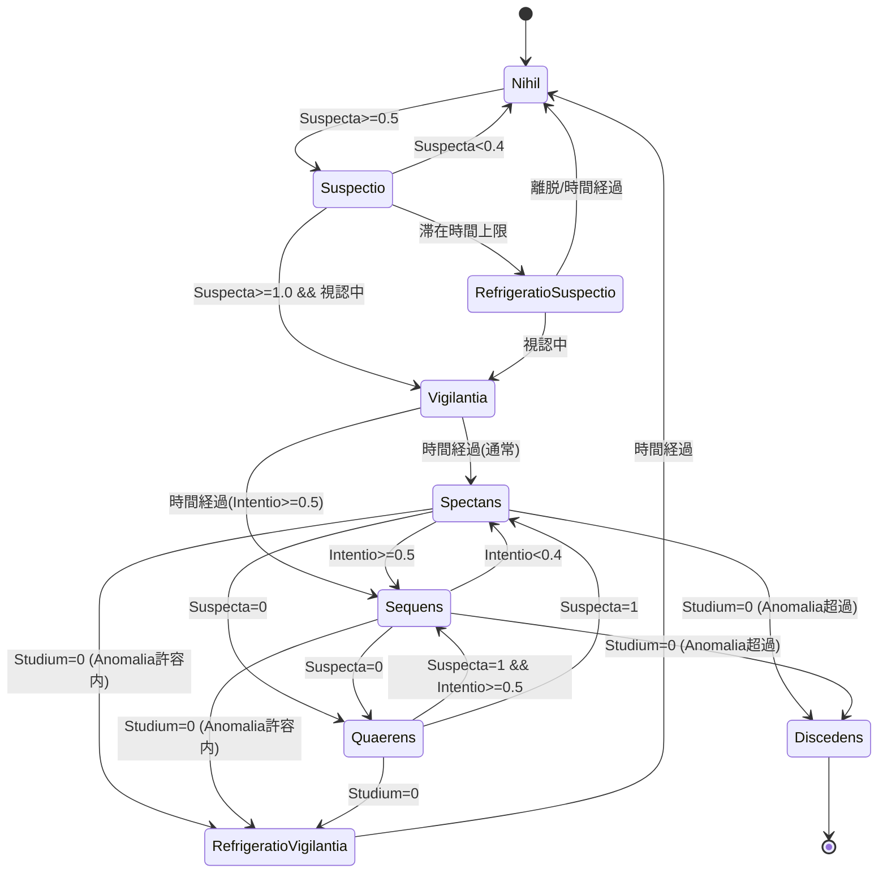

# Civis Custodia ステートマシン仕様

Miles(市民)の警戒挙動を制御するステートマシン(`MachinaCustodiae`)の仕様。
各ステートは毎フレーム `Ordinare` で疑心・興味・緊張などの内部パラメータ(fluida)を増減させ、
その値と瞬間条件をもとに(将来実装する)遷移機構がステートを切り替える。

- enum: `IDCivisStatusCustodiae`
- ステート基底: `IStatusCivisCustodiae` / `StatusCivisCustodiaeAttendens` / `StatusCivisCustodiaeIntuitus`
- パラメータ実体: `ResFluidaCivisVeletudinis`
- Abaci(増減レート制御): `AbaciCivisStatus`
- 増減量計算: `ResolutorCivisStatus`

---

## パラメータ定義

### 蓄積パラメータ(fluida, 0.0〜1.0)

| 名前 | 意味 | 増加条件 | 主な役割 |
|---|---|---|---|
| `Suspecta` | 疑心度 | 視覚刺激 or 聴覚刺激 | 未検知フェーズ全体の検知メーター。視覚と聴覚を1本に統合。 |
| `Studium` | 興味度 | 視認 && Anomalia耐性帯内(視認量非依存) | 追跡継続/離脱の判断。 |
| `Intentio` | 緊張度 | 視認 && Anomalia耐性帯内(視認量依存) | 注視(Spectans)/追跡(Sequens)の切替。 |

- `Suspecta` は `StatusCivisCustodiaeAttendens.ResolvereSuspectam` が解決する。
  - 視覚刺激(`EstCustodiaeVisae && EstVisa`)と聴覚刺激(`EstCustodiaeAuditae && EstAudita`)の
    いずれかで上昇し、両方無ければ減衰する。
  - 視覚由来の上昇レートを聴覚由来より速く設定(`_augmentumSuspectaeVisaeSec > _augmentumSuspectaeAuditaeSec`)。
  - 旧 `Visa` / `Audita` を統合したもの。「音か視覚か」「振り向くか注視か」は
    Suspecta値と瞬間の視認boolで判断するため、蓄積は1本に集約している。
- `Studium` / `Intentio` は `StatusCivisCustodiaeIntuitus` が解決する(Intuitusグループのみ)。

### 外部参照値

| 名前 | 出所 | 用途 |
|---|---|---|
| `Anomalia` | Puellaステート | Intentio/Studiumの上昇ゲート。`torelantiaAnomaliae` の帯内でのみ上昇。 |
| `torelantiaAnomaliaeMaxima/Minima` | Civis設定 | Anomalia許容帯の上下限。 |

### 瞬間条件(蓄積しないbool)

| 条件 | 判定 |
|---|---|
| 視認中 | `IResFluidaCivisCustodiaeLegibile.EstCustodiaeVisae && IResFluidaCivisCustodiaeLegibile.EstVisa` |
| 聴取中 | `IResFluidaCivisCustodiaeLegibile.EstCustodiaeAuditae && IResFluidaCivisCustodiaeLegibile.EstAudita` |

---

## ステートグループ

- **Attendensグループ**(`StatusCivisCustodiaeAttendens` 継承): Suspectaの増減を行う未検知フェーズ。
  - `Nihil` / `Suspectio` / `Quaerens`
- **Intuitusグループ**(`StatusCivisCustodiaeIntuitus` 継承 = Attendens + Intentio/Studium): 検知後フェーズ。
  - `Spectans` / `Sequens`
- **単独**: `Vigilantia`(Intuitusの入口)
- **終端/冷却**(未実装): `Discedens` / `RefrigeratioSuspectio` / `RefrigeratioVigilantia`

---

## ステート詳細

### Nihil
- グループ: Attendens
- 起点ステート。Suspecta/Studium と Abaci を初期化する(`dtSuspecta: -1`, `dtStudium: -1`, `Abaci.Purgere`)。
- Suspecta増減のみ実行。
- 遷移:
  - `Suspecta ≥ 0.5` → **Suspectio**

### Suspectio
- グループ: Attendens
- 旧 `SuspectioAuditae` / `SuspectioVisae` を統合。Suspectaが疑心域(0.4〜1.0)にある間の状態。
- 入場で滞在時間タイマー(`HorologiumTemere`, 8〜15s)を起動。
- Suspecta増減を継続し、タイマー到達時に `dtSuspecta: -1`(冷却へ誘導)。
- 遷移:
  - `Suspecta ≥ 1.0` **かつ 視認中** → **Vigilantia**(確定検知)
  - `Suspecta < 0.4`(刺激消失による自然減衰) → **Nihil**
  - 滞在時間タイマー到達 → **RefrigeratioSuspectio**(タイマー優先)
- 補足: 聴覚のみではSuspectaが1に達しても「視認中」を満たさないためVigilantiaに至らない。
  未視認のまま溜まった状態=旧Auditaの「振り向いて確認」に相当する。

### Vigilantia
- Intuitusの入口ステート(単独クラス)。
- 入場で `dtSuspecta: 1`, `dtStudium: 1` に固定し、確定タイマー(`Horologium`, 4s)を起動。
- 退場で Intentio/Studium を初期化(`dtIntentio: -1`, `dtStudium: -1`, `Abaci.PurgereStudii/Intentionis`)。
- 遷移:
  - 一定時間経過(タイマー到達) → **Spectans**(通常) / **Sequens**(`Intentio ≥ 0.5`)

### Spectans
- グループ: Intuitus
- Suspecta(基底) + Intentio/Studium を解決。消極アクション(その場で注視)想定。
- 視認ロスト(`_horologiumAdAmittens` 到達)で `dtSuspecta: -1`。
- Anomalia > `torelantiaAnomaliaeMaxima` が一定時間継続で Intentio/Studium を 0 にする(`_horologiumAdRecsationem`)。
- 遷移:
  - `Intentio ≥ 0.5` → **Sequens**
  - `Suspecta = 0`(視認ロスト) → **Quaerens**
  - `Studium = 0` かつ `Anomalia ≤ torelantiaAnomaliaeMaxima` → **RefrigeratioVigilantia**
  - `Studium = 0` かつ `Anomalia > torelantiaAnomaliaeMaxima` → **Discedens**

### Sequens
- グループ: Intuitus
- Spectansと同一処理。積極アクション(追跡)想定。
- 遷移:
  - `Intentio < 0.4` → **Spectans**(Spectans↔Sequensはヒステリシス)
  - `Suspecta = 0`(視認ロスト) → **Quaerens**
  - `Studium = 0` かつ `Anomalia ≤ torelantiaAnomaliaeMaxima` → **RefrigeratioVigilantia**
  - `Studium = 0` かつ `Anomalia > torelantiaAnomaliaeMaxima` → **Discedens**

### Quaerens
- グループ: Attendens
- 入場で `dtSuspecta: -1`、失探タイマー(`_horologiumAdCassationem`, 4〜8s)と再発見タイマー(`_horologiumAdInveniens`, 0.5〜1.5s)を起動。
- 退場で Intentio/Studium の Abaci を初期化(Intuitus再入場に備える)。
- Suspecta増減(基底) + 以下:
  - 失探タイマー到達 → `dtStudium: -1`
  - 視認中かつ再発見タイマー到達 → `dtSuspecta: 1`
- 遷移:
  - `Suspecta = 1` かつ `Intentio ≥ 0.5` → **Sequens**
  - `Suspecta = 1` → **Spectans**
  - `Studium = 0` → **RefrigeratioVigilantia**

### Discedens (未実装)
- 終端ステート。逃走アクション後にNPCを除去する。

### RefrigeratioSuspectio (未実装)
- Suspectioの冷却状態。Suspectioアクションを行わないNihil相当。
- 遷移:
  - 視認中(Suspecta再上昇で1) → **Vigilantia**
  - 一定距離離脱 / 一定時間経過 → **Nihil**

### RefrigeratioVigilantia (未実装)
- 興味喪失(Studium=0)後の冷却状態。追跡直後の即再検知を抑制する。
- 遷移:
  - 一定時間経過 → **Nihil**
  - ※再検知時にIntuitus(Spectans/Sequens)へ復帰させるかは要検討。

---

## 遷移図

---

## 実装状況・要検討事項

- **未実装**: 遷移機構本体(`MachinaCivisCustodiae` は空)、`Discedens` / `RefrigeratioSuspectio` / `RefrigeratioVigilantia` の各ステートクラス。
- **設定値**: 各ステートの `_augmentum*Sec` / `_tempus*` / タイマー値はコード内ハードコード(`後で設定に移行する`)。
- **要検討**:
  - `Vigilantia → Spectans/Sequens` の分岐条件(現状はIntentio閾値を暫定採用)。
  - `RefrigeratioVigilantia` の再検知時挙動(Nihil経由 vs Intuitus直帰)。
  - 別系統 `Custodia/Custodia/`(`ResolutorCivisSuspectae` 等)もSuspecta/Visa/Auditaを更新するため、
    本ステートマシン稼働時の役割分担(どちらがSuspectaの権威か)を整理する必要がある。
